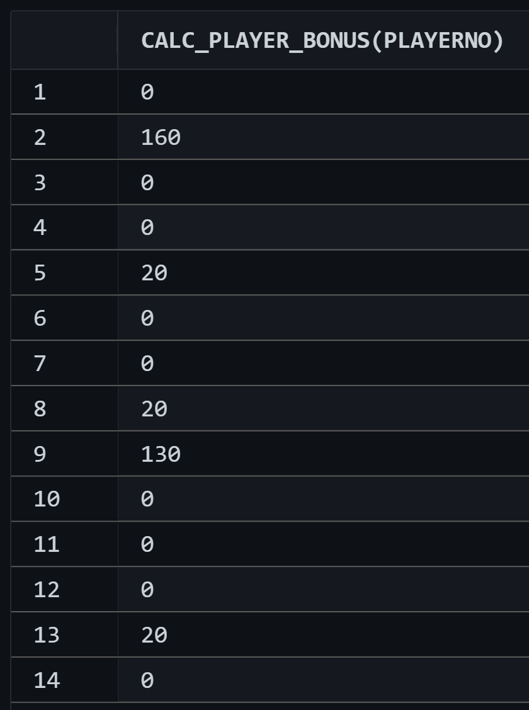

  ###### <p align="center"> DbiUebung-004 </p>

<div align="center">
  
  # PLSQL - `CURSOR` 

  - <div align="left"> 
    
    $\Large\color{lime}{Funktion:}$ CALC_PLAYER_BONUS( PLAYERNO ):
    
    - Fertige Ausgabe:  
      > *Erst alle ( Hilfs- )*`FUNCTIONS` *kompilieren, dann kann die Ausgabe ausgeführt werden*!  

  </div>

  |    Nur die Werte:                                  |  Formatiert:                                          |  
  |:---------------------------------------------------|:------------------------------------------------------|  
  |   |  |  

---

</div>
  
  - <p align="left"> Code Snippets: </p>
  
    - ## Funktionsaufruf / Ausgabe:
      ```SQL
      SELECT CALC_PLAYER_BONUS( PLAYERNO ) FROM PLAYERS;
      ```
      ```SQL
      SELECT                                      
          pl.PLAYERNO                            as "Spielernummer"
        , pl.NAME                                as "Familienname"
        , CALC_PLAYER_BONUS( p.PLAYERNO ) || '€' as "Bonuszahlungen"
        , CALC_PLAYER_MATCH_COUNT( m.PLAYERNO )  as "Matchanzahl"
        FROM PLAYERS p 
          JOIN PLAYERS pl ON( pl.PLAYERNO = p.PLAYERNO )
          JOIN MATCHES m ON( m.PLAYERNO = p.PLAYERNO )
            GROUP BY
                pl.PLAYERNO
              , pl.NAME
              , p.PLAYERNO
              , m.PLAYERNO
            ORDER BY "Matchanzahl" desc;
      COMMIT;
      ```
    
      ---
      - ## Errechnet den erspielten Bonus eines Spielers:
      ```SQL
      CREATE or REPLACE 
                FUNCTION 
                        CALC_PLAYER_BONUS( player_Num in NUMBER )
      ---------------------------------------------------------------------
      RETURN VARCHAR 
        IS
            money   NUMBER := 0
          ; diff    NUMBER := 0
          ; sumWon  NUMBER := 0
          ; sumLose NUMBER := 0
        -- - - - - - - - - - - - --
          ; tempM   matches%ROWTYPE
          ; CURSOR  m is SELECT * FROM matches WHERE player_Num = PLAYERNO
              ORDER BY PLAYERNO 
        -- - - - - - - - - - - - --
          ; sol Varchar(90) 
          ;
        BEGIN
          OPEN m;
          LOOP FETCH m INTO tempM;
          -------------------------------------
            IF m%FOUND THEN
            -- - - - - - - --
              IF player_Num = tempM.playerno then
                diff := tempM.won - tempM.lost;
                -- - - - - - - --
                IF diff >= 3 THEN
                  money := money + 100; 
                END IF;
                -- - - - - - - --
                IF diff < 0 THEN
                  diff := 0;
                END IF;
                -- - - - - - - --
                money := money + ( tempM.won * 10 ) - (tempM.lost * 5);
                sumLose := sumLose + tempM.lost;
                sumWon := sumWon + tempM.won;
                -- - - - - - - --
                IF money < 0 THEN
                  money := 0;
                END IF;
                -- - - - - - - --
              END IF;
              sol := ( 
                      'Spieler-Nummer: ' || LPAD(player_Num,3,' ') ||
                      '   | Bonus: '     || LPAD(money,     4,' ') ||
                      '€  | Wins/Loses: '|| LPAD(sumWon,    2,' ') ||
                      '/'                || LPAD(sumLose,   2,' ')
                     );
            END IF;
          -- - - - - - - --
          EXIT WHEN m%NOTFOUND;
            diff := 0;
          END LOOP;
          -------------------------------------
          dbms_output.put_line( sol );
        RETURN money;
        CLOSE m;
      END;
      ```

      ---
      - ### Errechnet die Anzahl aller gespielten Matches:
      ```SQL
      CREATE or REPLACE 
                FUNCTION 
                        CALC_PLAYER_MATCH_COUNT ( pl_num NUMBER )
      -------------------------------------------------------------------------------
      RETURN NUMBER
        IS
          CURSOR t IS 
            SELECT 
                SUM( m.WON ) + SUM( m.LOST ) as summe
            --    , p.*
            --  , p.playerNo
            --  , p.name 
                FROM MATCHES m JOIN PLAYERS p 
                  on ( p.PLAYERNO = m.PLAYERNO )
                    WHERE p.PLAYERNO = pl_num
                    GROUP by 
                        p.PLAYERNO
                      , p.HOUSENO
                      , p.INITIALS
                      , p.LEAGNO
                      , p.NAME 
                      , p.PHONENO 
                      , p.POSTCODE
                      , p.SEX
                      , p.STREET
                      , p.TOWN
                      , p.YEAR_JOINED
                      , p.YEAR_OF_BIRTH
        ; temp NUMBER := 0
        ;
      -------------------------------------
      BEGIN
        open t;
          FETCH t into temp;
        -- - - - - - - - - - - - --
          RETURN temp;
        -- - - - - - - - - - - - --
        close t;
      END;
      ``` 
